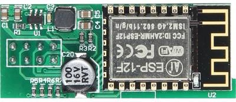
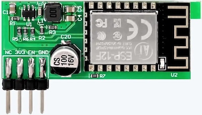
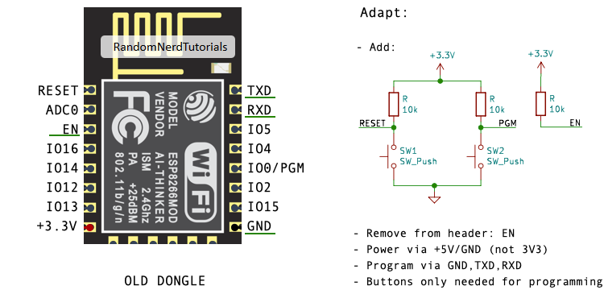
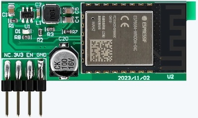
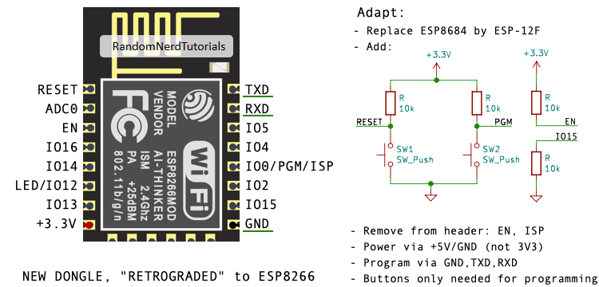
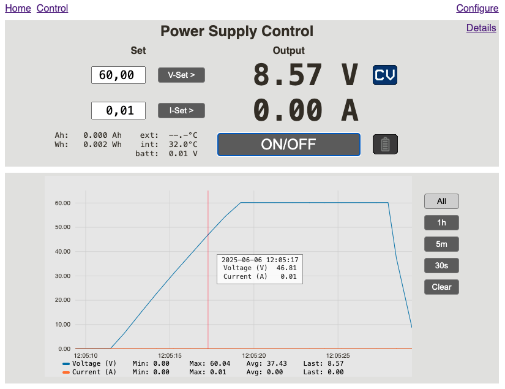

# Riden Dongle - A Multi-Protocol Firmware for the Riden WiFi Module

This is an alternative firmware for the Riden WiFi module that
provides Modbus TCP and SCPI support as well as a web interface.

It supports the following Riden power supplies:

- RD6006 (might not work on the earlier china only versions, but supports the regular version)
- RD6012
- RD6018
- RD6024
- RD6030
- RD6006P
- RD6012P

The following is not yet integrated, as it is very new.

- RD6018P

The firmware has been tested with various tools and libraries:

- Riden Firmware
  - Riden v1.28
  - Riden v1.41
  - Riden v1.47 (6030)
  - Unisoft v1.41.1k (6006)
  - Unisoft V1.37.1p (6012)
- Modbus TCP
  - [Python pyModbusTCP library](https://pypi.org/project/pyModbusTCP/)
  - [Python pymodbus library](https://pypi.org/project/pymodbus/)
  - A modified version of [ridengui](https://github.com/ShayBox/RidenGUI)
    with Modbus TCP support hacked in
- SCPI
  - [lxi-tools](https://github.com/lxi-tools/lxi-tools)
  - [EEZ Studio](https://www.envox.eu/studio/studio-introduction/)
  - [PyVISA](https://pyvisa.readthedocs.io/)

## Features

- Modbus RTU client communicating with Riden power supply firmware.
- Modbus TCP bridge.
- SCPI control
  - via raw socket (VISA string: `TCPIP::<ip address>::5025::SOCKET`)
  - and via vxi-11 (VISA string: `TCPIP::<ip address>::INSTR`).
- Web interface to configure the dongle, update the firmware, and remote control, with graph functions.
- Automatically set power supply clock based on NTP.
- mDNS advertising.
- Handles approximately 65 queries/second using Modbus TCP or raw socket SCPI
  (tested using Unisoft v1.41.1k, UART baudrate set at 921600).


## Warning

- When flashing the Riden WiFi module you _will_ erase the existing firmware.
- The firmware provided in this repository comes with no warranty.


## Query Performance

The regular Riden power supply firmware is considerably slower than UniSoft,
handling less than 10 queries/second. It is probably best to keep the UART baud rate at 19200 for the regular Riden power supply firmware. With UniSoft's firmware you can go significantly higher.


## VISA communication directives

An example test program can be found under [/scripts/test_pyvisa.py](/scripts/test_pyvisa.py)


### VXI-11

The VXI-11 channel (`TCPIP::<ip address>::INSTR`) is auto discoverable via mDNS, TCP and UDP, making it highly compatible with most tools.

While you use the VXI server, the raw socket server is disabled.

Note that when you use the web interface to kill a VXI-11 client, it will not properly inform the client. It will just kill the connection.


### Raw sockets

Raw socket capability cannot be auto discovered by pyvisa as of now. It can be discovered by lxi tools (see below)

When using the raw sockets (`TCPIP::<ip address>::5025::SOCKET`), you must, like with most other raw socket devices, use

```python
  inst.read_termination = "\n"
  inst.write_termination = "\n"
```

Also, be aware that when writing many commands to the device, the network layers and the device will queue them up. As a result, there can be a significant delay between the moment your client issues a command, and the moment the device handles the command. If you do not want that, insert a sleep of more than 150ms after each write command, forcing the network to send 1 command at a time. (the minimum delay depends on the configuration of your platform)

VXI-11 does not have this problem, since every command requires an ACK.

## Hardware Preparations

> There are various dongles available. This firmware is at this moment only compatible with ESP-12F based modules. The newer dongles use an ESP8684, but it is possible to do a retrofit with an ESP-12F. See below.

You will need to make some changes. The 2 most important being:

- pull EN high, as the TTL mode of the power supply does not do that, and remove or cut the pin from the header.
- program the dongle

Either you solder on the needed components and pins directly to the WiFi module, either you put a small PCB on top of the ESP metal housing (do not cover the antenna!) with the required resistors and maybe buttons, and connect that PCB to the WiFi module.

Whatever you use, in order to flash the device, you will need the following:

- power of course: 5V + GND (on the existing header).
- connect your serial link to GND, RX, TX (on the existing header)
- pull EN to 3V3 all the time via a resistor (10k). Take the 3V3 from the module, do not use the header, as some dongles do not have the 3V3 pin on the header connected.
- during boot, connect GPIO0 (aka PGM) to GND for a short period, and after that, pull it to 3V3 via a resistor (10k). A push button may be helpful here.
- not strictly needed, but helpful: a reset button connected to RST/RESET. If used, programming will be easier, as there is no need for power cycling to do programming. Push both RESET and PGM, let go of RESET, and then let go of PGM.

_Dongle with ESP-12F:_

The original dongles used this module.



Lately there have been ESP-12F based dongles in a new form factor. They are difficult to obtain now.



Here is how to adapt it:



_Dongle with ESP8684:_

These are the newer dongles.



That ESP8684 is not supported, and is not likely to be supported soon, as Riden has flashed its own proprietary firmware on it and has encrypted it (the SPI_BOOT_CRYPT_CNT eFuse = 0b111). Unless we get access to their encryption key, we will not be able to flash it.

**But** you can make the dongle work by removing the ESP8684 and soldering a ESP-12F in place. Those WiFi modules can still be found. See here how to do it:



(the led on the board will not be used by the software)

Be aware that some sellers of Riden dongles may deliver you an ESP8684 dongle, even if their images show a ESP-12F on the dongle.

## Download the Firmware from GitHub

Firmware files will be
[released on GitHub](https://github.com/morgendagen/riden-dongle/releases)
as part of the repository.


## Compiling the Firmware

If you want to compile, you will need [PlatformIO](https://platformio.org/) in order to
compile the firmware.

No configuration is necessary; simply execute `pio run` and wait.
The firmware is located at `.pio/build/esp12e/firmware.bin`.


## Flashing the Firmware

Provided you have prepared the hardware as described, and have either compiled, or downloaded a binary, you must connect the dongle to your computer as you would when flashing any other ESP12F module.

You can use multiple tools to flash the firmware. The most well known are:

- platformio
- esptool (also available without installation: https://espressif.github.io/esptool-js/)

Example with PlatformIO:

   pio run -t upload --upload-port <ESP12F serial port>

and wait for the firmware to be flashed.

Before re-inserting the module into your power supply,
it may be a good idea to make the necessary configuration
changes. You need to select `TTL` as the UART Interface mode,
9600 as the speed/UART baudrate, and (modbus) Address as 1 (the default).

Re-insert the module and power up the power supply.

The module will begin to flash, first slowly and then
faster. If it starts flashing really fast (5 flashes
per second), you probably misconfigured the power supply.
Double-check, and if you are still having issues, add
an issue to the Github repository.

If all is well, the module has created a new access
point, named `RDxxxx-ssssssss` (`xxxx` is the model
and `ssssssss` is the serial number), e.g.
`RD6006-00001234`.

Connect to this access point, and you will be greeted
by a web page allowing you to configure the WiFi network
that the module should connect to.

Follow the instructions, and save the configuration.

If all goes well, the blue LED will start to flash slowly
after a short while, and eventually stop. You should now
be able to connect to the dongle at
http://RDxxxx-ssssssss.local.

## Power Supply Configuration requirements

Make sure that you have set

* the 'UART Interface' setting to 'TTL' or 'TTL+EN'
* the 'UART Baudrate' to the same speed as you have set the dongle. 9600 is good for starters, but PSUs with Unisoft custom firmware can easily handle 115200
* the 'Address' setting to '1'

If you have the Unisoft custom firmware, the 'Server IP' is not used, as the dongle firmware will take care of that now.

## Using lxi-tools to Verify Installation

Execute the command

    lxi discover -m

to get a list of discovered SCPI devices on the network.
This firmware sneakily advertised `lxi` support in order
for lxi-tools to recognise it.

Execute the command

    lxi scpi -a RDxxxx-ssssssss.local -r "*IDN?"

to retrieve the SCPI identification string containing
power supply model, and firmware version.

Execute the command

    lxi scpi -a RDxxxx-ssssssss.local -r "VOLT?"

to retrieve the currently set voltage.

Invoke

    lxi scpi -a RDxxxx-ssssssss.local -r "VOLT 3.3"

to set the voltage to 3.3V

A description of the implemented commands is
available in [SCPI_COMMANDS.md](SCPI_COMMANDS.md).


## OTA firmware update

In order to update the firmware, you may prefer
to use OTA update instead of having to remove
the module from the power supply and connecting
it to a computer.

From the `Configure` web page you can upload a
new firmware binary.


## Remote control via the Web interface

The `Control` web page allows remote control over:

- Voltage and Current setting
- Output On/Off

It also allows reading various values:

- Output values
- CV/CC mode, OVP/OCP protection
- temperatures
- ...

The output values are graphed (updated every second), and will allow different time scales and zooming in.

<kbd></kbd>


## Limitations

The Riden power supply firmware has some quirks as described
below. The firmware provided here err towards caution, and
does not implement functionality that is known to be
unreliable.


### Currently Active OVP and OCP Values

There is no way to reliably retrieve these values. If they are set
by selecting a preset, M0 does not reflect the new values. If they
are set via the front panel, M0 does reflect the new values.

Therefore I have decided NOT to support `*SAV`. `*RCL` is implemented.


### Preset Register

The Preset register (19) only reflects the active preset if
changed via the modbus interface. It is not updated if a preset
is selected using the front panel. Therefore it is currently not
possible to retrieve the selected preset.


### Language Selection

Only 0 and 1 are recognised when setting the Language register. Reading
the register matches the language set from the front panel.


### Keypad

It is not possible to control the keypad lock.

Note that when you have the Riden firmware, while you use remote control or the web server (and especially the Control page), the keypad is locked automatically. That lock will be released a couple of seconds after the last use.


### Modbus Register 69 (Buzzer Enabled)

Older versions of the UniSoft custom firmware, before "1p", like RD6006 V1.41.1k,
return an inverted value for modbus register 69 (buzzer enabled).

The outcome is that, depending on the Riden firmware installed,
writing the register works as expected, but reading it back may
produce an incorrect result. Likewise the SCPI command
`SYST:BEEP:STATE?` may also return an incorrect value.

Riden standard firmware, and Unisoft "1p" versions and up, do _not_ exhibit this issue.

## Credits

- https://github.com/emelianov/modbus-esp8266
- https://github.com/sfeister/scpi-parser-arduino
- https://github.com/j123b567/scpi-parser
- https://github.com/ShayBox/Riden
- https://github.com/tzapu/WiFiManager
- https://github.com/nayarsystems/posix_tz_db
- https://github.com/awakephd/espBode
